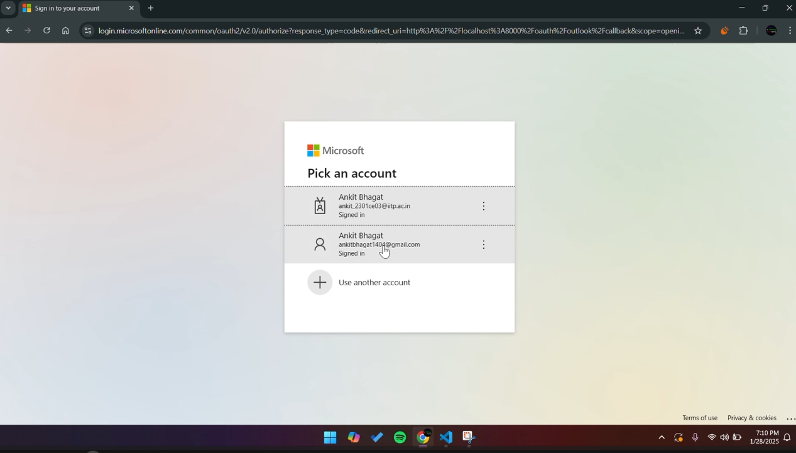
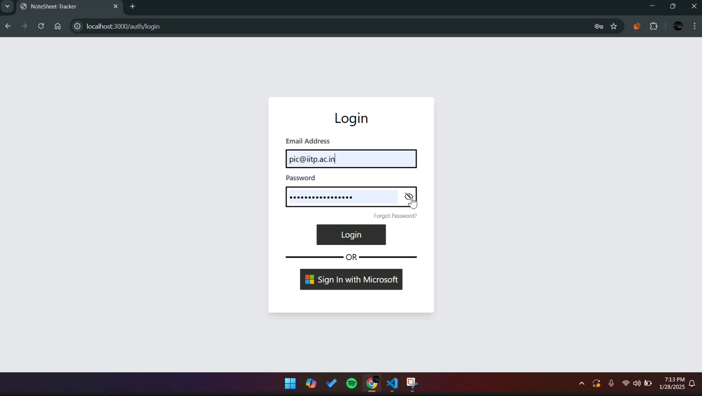
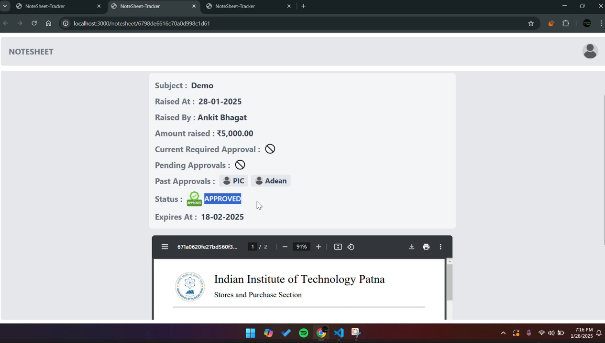

# Notesheet Tracker

The **Notesheet Tracker** is a comprehensive platform designed to streamline the management and approval process of financial notesheets for clubs and fests at **Indian Institute of Technology, Patna (IIT Patna)**. This system ensures transparency, efficiency, and accountability by enabling the creation, customization, approval, and tracking of financial notesheets through a structured workflow.

### Key Features

-   **Templates for Notesheets**:

    -   **Reimbursement**: Submit requests for reimbursement of personal expenses incurred during an event.
    -   **Disbursement**: Request advance funds for an upcoming event.
    -   **Settlement**: Finalize and settle all expenses and bills after an event concludes.

-   **Approval Workflow**:
    Notesheets pass through a predefined sequence of approvals:

    1. General Secretary (GenSec)
    2. Vice President Gymkhana (VP)
    3. ARSA/DRSA
    4. President Gymkhana
    5. Payment In Charge (PIC)
    6. Associate Dean (ADean)
       Each approver can either forward the notesheet with their comments or reject it with reasons.

-   **Customizable Notesheets**:
    Clubs and fests can use pre-designed templates or upload their own PDFs to create notesheets.

-   **Reminders for Pending Tasks**:
    Automated daily reminders for pending approvals to ensure timely processing.

-   **Full Audit History**:
    Every individual involved in the approval chain can view the complete history of their actions, including dates and comments, with the ability to download notesheets as PDFs.

-   **Digital Signatures**:
    Forwarded notesheets include verifiable digital signatures for authenticity.

-   **Expense Tracker**:
    -   Clubs can view their expenditures.
    -   GenSec can view club-specific data.
    -   Admins and higher authorities can view a categorized overview of all expenditures.

---

## Installation Guide

To set up the project, install all dependencies from the root directory:

```bash
npm run install-all
```

This command installs dependencies for both the client and server.

## Running Guide

To start the development environment, run the following command from the root directory:

```bash
npm run dev
```

This will launch both the client and server concurrently. The application will be accessible at:

-   **Client**: [http://localhost:3000](http://localhost:3000)
-   **Server**: [http://localhost:8000](http://localhost:8000)

To start either the client or server individually:

```bash
# Start the client
npm run client

# Start the server
npm run server
```

---

## Production Guide

Run the application in production mode from the root directory with:

```bash
npm start
```

This starts both the client and server in a production environment.

---

## Tech Stack

-   **Frontend**: [Next.js](https://nextjs.org/) with [Tailwind CSS](https://tailwindcss.com/)
-   **Backend**: [Node.js](https://nodejs.org/) with [Express](https://expressjs.com/)
-   **Database**: [MongoDB](https://www.mongodb.com/) with [Mongoose](https://mongoosejs.com/)

---

## Demo

Below are screenshots showcasing the roles and responsibilities of different users in the **Notesheet Tracker** workflow. Each image links to the corresponding video demo for more details.

### 1. User POV

[](https://drive.google.com/file/d/1aKb41pOznM3RUklQKj3pEbA0u_BmjQOp/view?usp=sharing)  
_Click the image to watch the demo._

The user logs in using Microsoft OAuth and accesses their dashboard to view all previously raised notesheets. The demo highlights how the user raises a new notesheet, which enters the approval workflow starting with the PIC.

---

### 2. PIC POV

[](https://drive.google.com/file/d/13pU6N0UpKEzw35U8tpzjjOeqSbTyBR3g/view?usp=sharing)  
_Click the image to watch the demo._

The Payment In Charge (PIC) logs in using their email and password (JWT authentication). The demo shows how the PIC reviews pending notesheets, approves the recently raised notesheet, and adds their signature to the PDF.

---

### 3. ADean POV

[](https://drive.google.com/file/d/1ytr6IJjRNMNwru59bdF5ybZQOfhSXIuz/view?usp=sharing)  
_Click the image to watch the demo._

The Associate Dean (ADean) logs in to approve notesheets that have already been reviewed by the PIC. In this demo, the ADean approves the notesheet, marking it as passed for funds, completing the approval process.